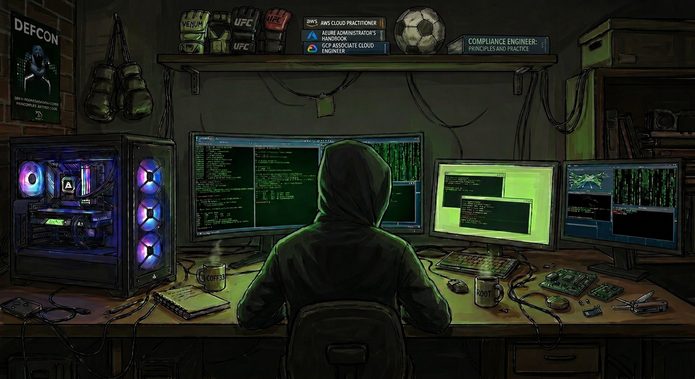

  

<svg width="500" height="80" xmlns="http://www.w3.org/2000/svg">
  <defs>
    <linearGradient id="grad" x1="0%" y1="0%" x2="100%" y2="0%">
      <stop offset="0%" style="stop-color:#00D4FF">
        <animate attributeName="stop-color" values="#00D4FF;#FF4500;#FF0000;#00D4FF" dur="4s" repeatCount="indefinite"/>
      </stop>
      <stop offset="50%" style="stop-color:#FF4500">
        <animate attributeName="stop-color" values="#FF4500;#00D4FF;#FF4500;#FF4500" dur="4s" repeatCount="indefinite"/>
      </stop>
      <stop offset="100%" style="stop-color:#FF0000">
        <animate attributeName="stop-color" values="#FF0000;#FF4500;#00D4FF;#FF0000" dur="4s" repeatCount="indefinite"/>
      </stop>
    </linearGradient>
  </defs>
  <text x="50%" y="55" font-family="Fira Code, monospace" font-size="42" font-weight="700" fill="url(#grad)" text-anchor="middle">Brian Montiel</text>
</svg>

  

 

  &nbsp;&nbsp;
  &nbsp;&nbsp;
  

---

### About Me

Security analyst, hacker, and builder focused on FedRAMP, cloud security, and building tools that make compliance work less painful. By day I run NIST 800-53 assessments across AWS, GCP, and Azure. Outside work I'm in the gym training Boxing, Muay Thai, and Judo or trying a restaurant I've never been to before. Always open to collaborating on security and GRC projects.

---

### What I Do

- **Cloud Security Assessments** — FedRAMP, GovRAMP, DoD IL4/IL5 across AWS, GCP, and Azure
- **GRC Automation** — building Python tooling to replace manual compliance workflows
- **Offensive Security** — red team concepts, CTFs, HackTheBox write-ups
- **Open Source** — GRC and security tools built for practitioners

---

### Certifications

  &nbsp;&nbsp;&nbsp;
  &nbsp;&nbsp;&nbsp;
  &nbsp;&nbsp;&nbsp;
  &nbsp;&nbsp;&nbsp;
  

---

### Tech

  &nbsp;&nbsp;
  &nbsp;&nbsp;
  &nbsp;&nbsp;
  &nbsp;&nbsp;
  

---

### Outside the Terminal

🥊 MMA (Boxing · Muay Thai · Judo) &nbsp;&nbsp;|&nbsp;&nbsp; 🍜 Always trying a new restaurant &nbsp;&nbsp;|&nbsp;&nbsp; ✍️ Writing on <a href="https://medium.com/@bnight01">Medium</a>

